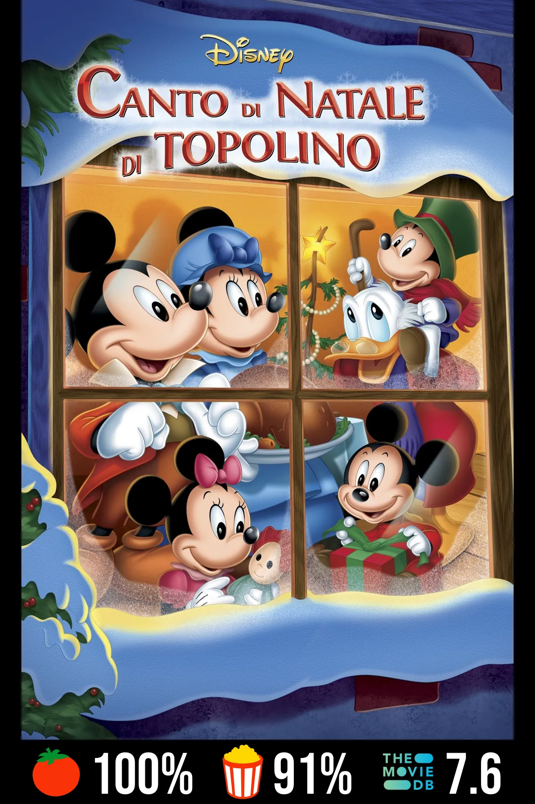
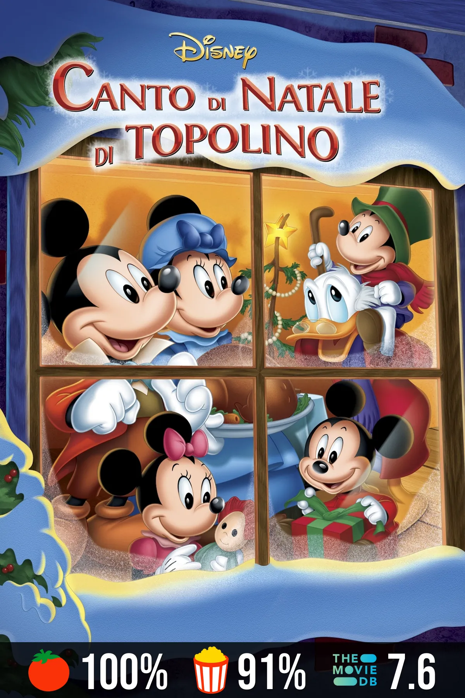

# Media Rating Overlay

[](https://github.com/zepollabot/media-rating-overlay/actions/workflows/go.yml)   [](https://codecov.io/gh/zepollabot/media-rating-overlay)

Media Rating Overlay is a powerful tool that enhances your media library by adding rating information from various sources directly onto your movie  posters. This project was inspired by [Rating Poster Database](https://ratingposterdb.com/) and [Kometa](https://github.com/Kometa-Team/Kometa).

The tool currently supports only Plex, with the idea to add the support to others media player applications (like Kodi, Jellyfin, etc.)

## Table of Contents
- [Features](#features)
- [Examples](#examples)
- [Quick Start](#quick-start)
  - [Using Docker Compose](#using-docker-compose)
- [Configuration](#configuration)
- [Documentation](#documentation)
- [Future Improvements](#future-improvements)
- [Source Code](#source-code)
- [Support](#support)

## Features

- 🎬 Automatically adds ratings from multiple sources:
  - TMDB
  - IMDB
  - And more...
- 🖼️ Overlays ratings directly onto your media posters
- 🛠️ Customizable rating display options
- 🐳 Docker support for easy deployment

## Examples 

<table>
  <tr>
    <td style="text-align: center; vertical-align: top;">
      <div style="font-size: 1.2em; font-weight: bold; padding-bottom: 5px; margin-bottom: 10px;">
        Frame
      </div>
      
    </td>
    <td style="text-align: center; vertical-align: top;">
      <div style="font-size: 1.2em; font-weight: bold; padding-bottom: 5px; margin-bottom: 10px;">
        Bar
      </div>
      
    </td>
  </tr>
</table>


## Quick Start

### Using Docker Compose

1. Clone the repository:
   ```bash
   git clone https://github.com/zepollabot/media-rating-overlay.git
   cd media-rating-overlay
   ```

2. Configure your environment:
   ```bash
   make setup-config
   ```
   and setup you variables inside `config.yaml` and `config.env.YOUR-ENV.yaml`

3. Start the service:
   ```bash
   docker compose up
   ```

See the [Installation Guide](docs/installation.md) for detailed information

## Configuration

The application uses YAML configuration files, one generic (`configs/config.yaml`) and one ENV base (e.g. `configs/config.env.prod.yaml`).

Key configuration options include:

- Plex server connection details
- Rating service API keys
- Logo display preferences
- Performance
- Logs preferences

See the [Configuration Guide](docs/configuration.md) for detailed information.

## Documentation

- [Installation Guide](docs/installation.md)
- [Configuration Guide](docs/configuration.md)
- [Usage Guide](docs/usage.md)


## Future Improvements

- Add support for other media player applications (Kodi, Jellyfin, Emby, etc..)
- Add more rating services (Metacritic, MyAnimeList, etc.)
- Add the ability to schedule a run

## Source Code

This project is licensed under the GNU Affero General Public License (AGPL) v3.0. The source code is available at:
- GitHub: https://github.com/zepollabot/media-rating-overlay
- Source Archive: https://github.com/zepollabot/media-rating-overlay/archive/refs/heads/main.zip

As required by the AGPL, if you run a modified version of this program on a server, you must make the source code available to your users. See the [LICENSE](LICENSE) file for more details.

## Support

If you need help or have questions:
- Open an issue on GitHub
- Join our community discussions
